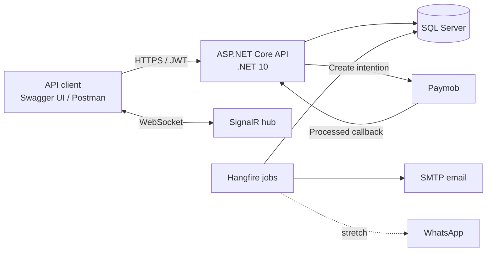
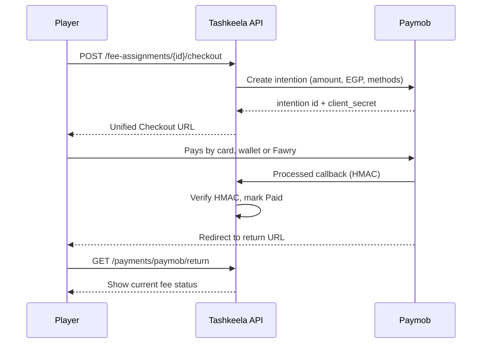
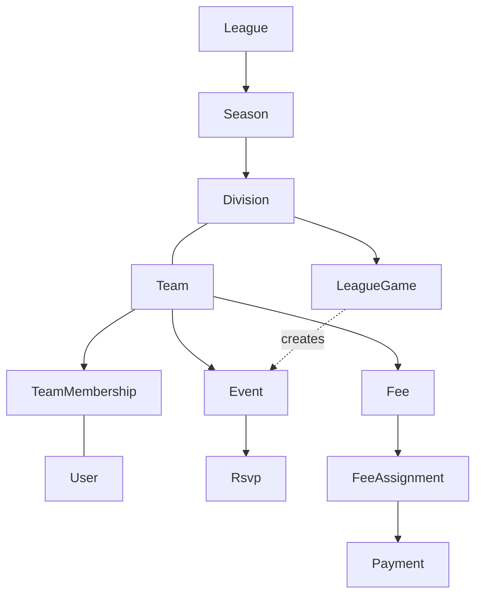
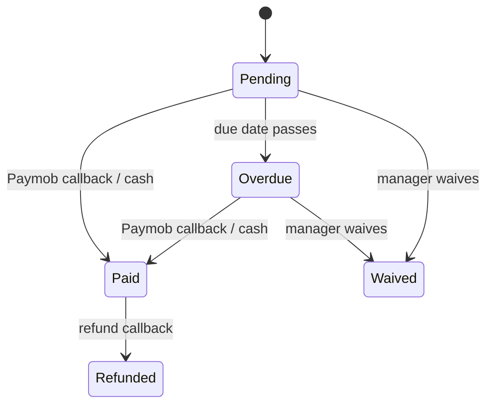
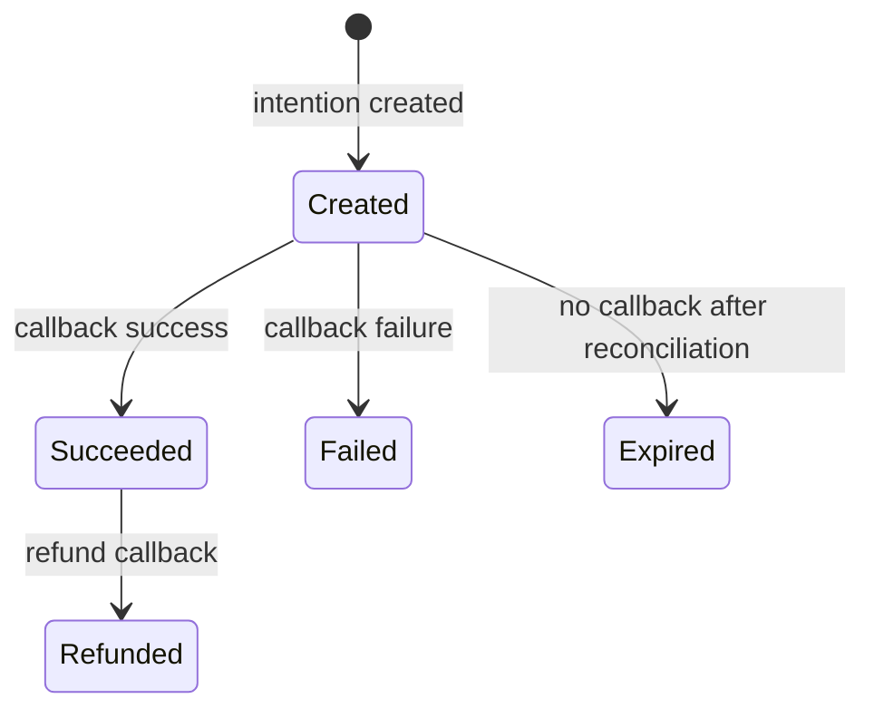

# Tashkeela — Software Requirements Specification

Sep 24, 2026 · @toqa

## 1. Introduction

### 1.1 Purpose

This SRS defines the requirements for Tashkeela (تشكيلة, Arabic for "lineup") v1.0, a backend API that helps adult amateur sports teams and local leagues in Egypt manage rosters, attendance, fees and communication. v1.0 is API-only: Swagger UI is the interface for exploring and testing it. The document is written for the developer, reviewers and recruiters evaluating the project.

### 1.2 Product Scope

Tashkeela replaces the WhatsApp groups, spreadsheets and cash-chasing that team organizers rely on today. Managers schedule events and see who is coming, collect fees online through Paymob or record cash payments, and message the team in real time. League organizers run seasons, schedules, scores and standings across many teams.

The v1.0 release covers seven feature areas: accounts, teams and rosters, events and RSVPs, automated reminders, fees and payments, team chat, and leagues and standings.

### 1.3 Definitions and Acronyms

| Term | Meaning |
| --- | --- |
| RSVP | A member's attendance response to an event: In, Out, Maybe or NoReply |
| Manager | A team member with permission to manage the team, events and fees |
| Spare | A substitute player called in when regulars are unavailable |
| Fee | A charge a manager requests from team members (e.g., pitch booking, monthly membership fee) |
| Fee assignment | One member's share of a fee, with its own payment status |
| Paymob | Egyptian payment gateway used for online collection (cards, mobile wallets, Fawry reference codes) |
| Intention | A Paymob payment request created by the server; the customer completes it on Paymob's checkout |
| HMAC | Hash-based message authentication code used to verify Paymob callbacks |
| EGP | Egyptian pound, the system's default currency |
| RTL | Right-to-left layout, required for Arabic |
| SRS | Software Requirements Specification |
| JWT | JSON Web Token used for API authentication |

### 1.4 References

- IEEE 830 / ISO/IEC/IEEE 29148 — structure of this SRS
- [Paymob Developer Portal](https://developers.paymob.com/)
- ASP.NET Core documentation — authentication, authorization, SignalR

### 1.5 Document Overview

Section 2 describes the product and its users. Section 3 defines external interfaces, including Paymob. Section 4 lists functional requirements by feature. Sections 5–7 cover quality attributes, data and permissions. Section 8 defines acceptance criteria and scope boundaries.

Requirement IDs follow the pattern `FR-<AREA>-<n>` for functional and `NFR-<AREA>-<n>` for non-functional requirements. Priority: **Must** = required for v1.0, **Should** = planned stretch, **Could** = future.

## 2. Overall Description

### 2.1 Product Perspective

Tashkeela is a new, self-contained backend system. It consists of an ASP.NET Core (.NET 10) REST API, a SignalR hub for real-time features and a background job processor, backed by SQL Server. v1.0 has no custom frontend; reviewers use Swagger UI served by the API. It depends on three external services: Paymob for online payments, an SMTP provider for email, and (as a stretch goal) the WhatsApp Business Platform for notifications.

The client talks only to the API and hub; all third-party calls happen server-side.

### 2.2 Market Context (Egypt)

The product targets organized adult amateur sport in Egypt, where coordination today happens in WhatsApp groups and money is often collected in cash. Youth teams and academies are not a target in v1.0.

| Segment | Typical need |
| --- | --- |
| Five-a-side football groups | Confirm enough players each week; split the pitch booking cost |
| Company and university leagues, Ramadan tournaments | Publish fixtures, record scores, show standings |
| Adult amateur clubs (basketball, volleyball) | Track attendance at training; collect monthly membership fees |
| Padel groups and ladders | Organize sessions and small tournaments |

This context drives four design decisions: EGP as the default currency, Paymob as the payment gateway, first-class support for cash payments, and Arabic-language notifications.

### 2.3 Product Functions

- Register, log in and manage a profile
- Create teams, invite players by link, manage the roster
- Schedule games and practices; collect RSVPs
- Send automatic reminders to members who have not replied
- Create fees; collect them via Paymob or record cash; track overdue payments
- Chat with the team in real time
- Run leagues: seasons, divisions, fixtures, scores and standings

### 2.4 User Classes

| User class | Description | Frequency of use |
| --- | --- | --- |
| Player | Adult team member who RSVPs, pays and chats | Weekly, mostly on mobile |
| Manager | Organizes a team or club; the main decision-maker | Several times a week |
| League Admin | Runs a league of roughly 8–30 teams | Weekly during a season |
| System Admin | Operates the platform; seeded account only | Rarely |

One user can hold different roles in different teams and leagues. Roles belong to a membership, not to the user account.

### 2.5 Operating Environment

- **Client:** any HTTP client; Swagger UI (served by the API) is the reference interface, and Postman is used for SignalR testing
- **Server:** .NET 10 (LTS) on Linux containers, hosted on Azure App Service
- **Database:** SQL Server 2022 locally (Docker), Azure SQL Database in production
- **Time zone:** timestamps stored in UTC; teams default to Africa/Cairo

### 2.6 Design and Implementation Constraints

- **C-1** API-only backend built with ASP.NET Core (.NET 10), EF Core, SQL Server and Clean Architecture; no custom frontend in v1.0.
- **C-2** Online payments go through Paymob; card data never touches Tashkeela servers.
- **C-3** Payment gateway access sits behind an `IPaymentProvider` interface so another provider (e.g., Stripe for international use) can be added without changing business logic.
- **C-4** All amounts are stored as integer minor units (piasters) with a currency code.
- **C-5** Payment status changes only on a verified server-side callback, never on a browser redirect.
- **C-6** The system runs in Paymob test mode for the public demo.

### 2.7 Assumptions and Dependencies

- **A-1** Users have an email address and a smartphone or computer with internet access.
- **A-2** A Paymob merchant account with test credentials and integration IDs is available.
- **A-3** Paymob remains available and backward-compatible with its Intention API.
- **A-4** Pitch or facility booking is handled outside Tashkeela; managers only record the resulting cost as a fee.

## 3. External Interface Requirements

### 3.1 API Documentation Interface (Swagger)

- **UI-1** v1.0 has no custom frontend. The API is explored and tested through Swagger UI at `/swagger`, rendered from the OpenAPI document that .NET 10 generates (`Microsoft.AspNetCore.OpenApi`).
- **UI-2** Endpoints are grouped by tag: Auth, Teams, Events, Fees, Payments, Chat, Leagues.
- **UI-3** Every endpoint has a summary, request and response examples, and its documented status codes (200, 201, 400, 401, 404, 409).
- **UI-4** Swagger UI supports JWT: the Authorize button accepts the bearer token returned by `/auth/login`.
- **UI-5** The Swagger landing description lists demo accounts and Paymob test payment details for reviewers.
- **UI-6** Swagger does not cover WebSockets, so the SignalR hub is documented in the README with a Postman WebSocket collection and a small sample client script.

### 3.2 REST API

- **API-1** JSON over HTTPS, versioned under `/api/v1`.
- **API-2** Authentication by JWT bearer token; refresh via rotating refresh token.
- **API-3** Errors returned as RFC 7807 `ProblemDetails` with a trace ID.
- **API-4** List endpoints paginate with `page` and `pageSize`; chat history uses a cursor (`before`).
- **API-5** OpenAPI document and Swagger UI published at `/swagger`.

| Area | Key endpoints |
| --- | --- |
| Auth | `POST /auth/register`, `/auth/login`, `/auth/refresh`, `/auth/logout`, `/auth/forgot-password` |
| Teams | `GET/POST /teams`, `GET /teams/{id}/members`, `POST /teams/{id}/invitations`, `POST /invitations/{token}/accept` |
| Events | `GET/POST /teams/{id}/events`, `PUT /events/{id}`, `POST /events/{id}/cancel`, `PUT /events/{id}/rsvps/me` |
| Fees | `GET/POST /teams/{id}/fees`, `GET /me/fees`, `POST /fee-assignments/{id}/checkout`, `POST /fee-assignments/{id}/mark-paid-cash` |
| Payments | `POST /payments/paymob/callback`, `GET /payments/paymob/return` |
| Chat | `GET /teams/{id}/messages`, `PUT/DELETE /messages/{id}` |
| Leagues | `POST /leagues`, `POST /leagues/{id}/seasons`, `POST /divisions/{id}/games`, `PUT /games/{id}/score`, `GET /divisions/{id}/standings` |

### 3.3 Real-time Interface (SignalR)

- **RT-1** Hub at `/hubs/team`; JWT passed as the `access_token` query parameter.
- **RT-2** A client joins a team group only after the server verifies membership.
- **RT-3** Server events: `MessageReceived`, `MessageEdited`, `MessageDeleted`, `UserTyping`, `RsvpUpdated`, `FeeStatusChanged`.

### 3.4 Payment Gateway Interface (Paymob)

Tashkeela collects online payments through Paymob's Intention API and hosted Unified Checkout, so card and wallet details are entered on Paymob's page, never on Tashkeela.

The processed callback is the only event that changes payment status; the browser redirect only displays it.

- **PAY-IF-1** The server creates an intention with: amount in piasters, currency `EGP`, enabled payment method integration IDs, billing data (name, email, phone), a `special_reference` equal to the Tashkeela payment ID, the notification (callback) URL and the redirection URL.
- **PAY-IF-2** The server stores the returned intention ID and `client_secret`, then returns a Unified Checkout URL built from the public key and `client_secret`.
- **PAY-IF-3** Supported methods in v1.0: bank cards and mobile wallets (Must); Fawry reference code (Should).
- **PAY-IF-4** Every callback is verified by recomputing its HMAC-SHA512 signature with the merchant HMAC secret, using the field set and order Paymob documents. Callbacks that fail verification are rejected with HTTP 401 and logged.
- **PAY-IF-5** Callback processing is idempotent, keyed on the Paymob transaction ID.
- **PAY-IF-6** The callback amount and currency must match the stored payment; a mismatch flags the payment for review and does not mark it paid.
- **PAY-IF-7** Secret key, public key and HMAC secret are stored in configuration secrets, never in source control.
- **PAY-IF-8** Refunds are initiated from Paymob's dashboard in v1.0; the refund callback updates the fee to `Refunded`.

### 3.5 Email Interface

- **EM-1** Email sent over SMTP through an `IEmailSender` abstraction; Mailpit captures mail in local development.
- **EM-2** Templates for: email confirmation, password reset, team invitation, RSVP reminder, event changed/cancelled, fee created, fee overdue, payment receipt.
- **EM-3** Emails are bilingual (English/Arabic) based on the recipient's language preference (Should).

### 3.6 WhatsApp Interface (Should)

- **WA-1** Notifications can be delivered through the WhatsApp Business Platform using pre-approved message templates.
- **WA-2** WhatsApp is an additional `INotificationChannel`; users opt in per channel and email remains the fallback.

## 4. Functional Requirements

### 4.1 Accounts and Authentication

| ID | Requirement | Priority |
| --- | --- | --- |
| FR-AUTH-1 | The system shall let a visitor register with name, email, phone and password. | Must |
| FR-AUTH-2 | The system shall require email confirmation before first login. | Must |
| FR-AUTH-3 | The system shall issue a JWT access token (15 min) and a refresh token (7 days) on login. | Must |
| FR-AUTH-4 | The system shall rotate the refresh token on every use and revoke the token family if a used token is replayed. | Must |
| FR-AUTH-5 | The system shall support password reset via an emailed, single-use token valid for 1 hour. | Must |
| FR-AUTH-6 | The system shall let a user edit profile, language (EN/AR) and notification preferences. | Must |
| FR-AUTH-7 | The system shall revoke the refresh token on logout. | Must |

### 4.2 Teams and Rosters

| ID | Requirement | Priority |
| --- | --- | --- |
| FR-TEAM-1 | The system shall let any user create a team (name, sport, logo) and make the creator its Manager. | Must |
| FR-TEAM-2 | The system shall let a Manager invite people by email or shareable link; invite tokens expire after 7 days. | Must |
| FR-TEAM-3 | The system shall let an invitee accept an invite, registering first if needed, and join as Player. | Must |
| FR-TEAM-4 | The system shall let a Manager set each member's type (Regular/Spare), jersey number and position. | Must |
| FR-TEAM-5 | The system shall let a Manager promote a member to Manager or remove a member. | Must |
| FR-TEAM-6 | The system shall prevent removal or demotion of a team's last Manager. | Must |
| FR-TEAM-7 | The system shall let a member leave a team. | Must |
| FR-TEAM-8 | The system shall list all teams a user belongs to, with their role in each. | Must |

### 4.3 Events and Attendance

| ID | Requirement | Priority |
| --- | --- | --- |
| FR-EVT-1 | The system shall let a Manager create an event with type (Game/Practice/Other), start and end time, location, opponent, notes, RSVP deadline and minimum players. | Must |
| FR-EVT-2 | The system shall create an RSVP with status NoReply for every current member when an event is created. | Must |
| FR-EVT-3 | The system shall let a member set their RSVP to In, Out or Maybe until the RSVP deadline. | Must |
| FR-EVT-4 | The system shall let a Manager override any member's RSVP at any time. | Must |
| FR-EVT-5 | The system shall show counts per RSVP status and the list of names per status. | Must |
| FR-EVT-6 | The system shall flag an event when In responses are below its minimum players. | Must |
| FR-EVT-7 | The system shall let a Manager edit or cancel an event and notify all members. | Must |
| FR-EVT-8 | The system shall push RSVP changes to connected clients in real time. | Must |
| FR-EVT-9 | The system shall let a Manager create weekly recurring events. | Should |
| FR-EVT-10 | The system shall promote the first waitlisted spare when a Regular changes to Out. | Should |
| FR-EVT-11 | The system shall publish an iCal feed per team. | Should |

### 4.4 Notifications and Reminders

| ID | Requirement | Priority |
| --- | --- | --- |
| FR-NOT-1 | The system shall send reminders to members with NoReply 48 h and 24 h before an event (offsets configurable per team). | Must |
| FR-NOT-2 | Reminder emails shall contain signed one-click In/Out links valid until the RSVP deadline, usable without login. | Must |
| FR-NOT-3 | The system shall never send the same reminder to the same member twice. | Must |
| FR-NOT-4 | The system shall notify members when an event is created, changed or cancelled. | Must |
| FR-NOT-5 | The system shall notify assigned members when a fee is created and when it becomes overdue. | Must |
| FR-NOT-6 | The system shall let users opt out per notification category. | Must |
| FR-NOT-7 | The system shall deliver notifications through WhatsApp for users who opt in. | Should |

### 4.5 Fees and Payments

| ID | Requirement | Priority |
| --- | --- | --- |
| FR-FEE-1 | The system shall let a Manager create a fee with title, amount (EGP), due date and assigned members (all or selected). | Must |
| FR-FEE-2 | The system shall support splitting a total amount equally across assigned members (e.g., pitch cost). | Must |
| FR-FEE-3 | The system shall create one fee assignment per member with status Pending. | Must |
| FR-FEE-4 | The system shall let a member pay an assignment online through Paymob (card or mobile wallet). | Must |
| FR-FEE-5 | The system shall mark an assignment Paid only after a verified Paymob processed callback for the full amount. | Must |
| FR-FEE-6 | The system shall let a Manager record a cash or InstaPay transfer payment manually, with an optional note. | Must |
| FR-FEE-7 | The system shall let a Manager waive an assignment. | Must |
| FR-FEE-8 | The system shall mark unpaid assignments Overdue once the due date passes (daily job). | Must |
| FR-FEE-9 | The system shall show a finance dashboard per team: collected, outstanding, overdue and waived totals, split by online and cash. | Must |
| FR-FEE-10 | The system shall email a receipt after a successful online payment. | Must |
| FR-FEE-11 | The system shall record every status change in an audit log with actor and timestamp. | Must |
| FR-FEE-12 | The system shall support Fawry reference-code payments. | Should |
| FR-FEE-13 | The system shall support recurring monthly fees (e.g., club membership). | Should |
| FR-FEE-14 | The system shall track team expenses (pitch, equipment) against fees collected. | Could |

### 4.6 Team Chat

| ID | Requirement | Priority |
| --- | --- | --- |
| FR-CHAT-1 | The system shall provide one chat channel per team, visible only to members. | Must |
| FR-CHAT-2 | The system shall deliver messages in real time and persist them. | Must |
| FR-CHAT-3 | The system shall load history in pages of 50 messages using a cursor. | Must |
| FR-CHAT-4 | The system shall show typing indicators. | Must |
| FR-CHAT-5 | The system shall let authors edit or delete their messages and Managers delete any message. | Must |
| FR-CHAT-6 | The system shall support polls and pinned bulletins. | Should |

### 4.7 Leagues and Standings

| ID | Requirement | Priority |
| --- | --- | --- |
| FR-LG-1 | The system shall let a user create a league and become its League Admin. | Must |
| FR-LG-2 | The system shall let a League Admin create seasons with points rules (default W=3, D=1, L=0) and divisions. | Must |
| FR-LG-3 | The system shall let a League Admin invite existing teams into a division; the team's Manager must accept. | Must |
| FR-LG-4 | The system shall let a League Admin schedule games; each game appears as an event on both teams' schedules. | Must |
| FR-LG-5 | The system shall let a League Admin record a final score once the game has started. | Must |
| FR-LG-6 | The system shall compute standings per division: played, won, drawn, lost, goals for, goals against, goal difference, points. | Must |
| FR-LG-7 | The system shall order standings by points, then goal difference, goals for, then head-to-head result. | Must |
| FR-LG-8 | The system shall recalculate standings when a score is corrected. | Must |
| FR-LG-9 | The system shall let a League Admin send an announcement to all members of all teams in a league. | Must |
| FR-LG-10 | The system shall collect team registration fees for a season through Paymob. | Should |
| FR-LG-11 | The system shall broadcast live score updates. | Could |

Default points follow football convention (3 for a win) since football is the main sport in the Egypt market.

## 5. Non-Functional Requirements

### 5.1 Security

| ID | Requirement |
| --- | --- |
| NFR-SEC-1 | Passwords shall be hashed by ASP.NET Core Identity; accounts lock for 15 min after 5 failed logins. |
| NFR-SEC-2 | Refresh, invite, reset and one-click RSVP tokens shall be stored hashed and be single-purpose and expiring. |
| NFR-SEC-3 | Every API request shall be authorized against the caller's membership in the target team or league (resource-based authorization). |
| NFR-SEC-4 | Requests for teams or leagues the caller doesn't belong to shall return 404, not 403. |
| NFR-SEC-5 | Paymob callbacks shall be accepted only with a valid HMAC; amounts are always taken from the server record. |
| NFR-SEC-6 | Auth endpoints shall be rate-limited to 10 requests per minute per IP. |
| NFR-SEC-7 | CORS shall allow only explicitly configured origins (none in v1.0, since Swagger UI is same-origin). |
| NFR-SEC-8 | Secrets shall live in User Secrets locally and Azure Key Vault in production. |
| NFR-SEC-9 | All traffic shall use HTTPS with HSTS enabled. |
| NFR-SEC-10 | Personal data (phone, email) shall be visible only to members of the same team. |

### 5.2 Performance

| ID | Requirement |
| --- | --- |
| NFR-PERF-1 | Standard read endpoints shall respond in under 300 ms at the 95th percentile with demo data. |
| NFR-PERF-2 | Chat messages shall reach other connected members in under 1 s. |
| NFR-PERF-3 | The system shall support 200 concurrent users on a single App Service instance. |
| NFR-PERF-4 | Read queries shall use no-tracking projections; hot lookups shall be indexed. |
| NFR-PERF-5 | Division standings shall be cached and invalidated when a score changes. |

### 5.3 Reliability

| ID | Requirement |
| --- | --- |
| NFR-REL-1 | Payment callbacks and background jobs shall be idempotent. |
| NFR-REL-2 | Failed jobs shall retry with exponential backoff, up to 5 attempts. |
| NFR-REL-3 | RSVPs, fee assignments and game scores shall use optimistic concurrency. |
| NFR-REL-4 | A scheduled reconciliation job shall query Paymob for payments pending over 30 min, in case a callback was missed. |
| NFR-REL-5 | Health endpoints `/health/live` and `/health/ready` shall report database and job-server status. |

### 5.4 API Usability and Localization

| ID | Requirement |
| --- | --- |
| NFR-USE-1 | Every endpoint shall be documented and callable from Swagger UI without extra tooling. |
| NFR-USE-2 | Validation errors shall return field-level messages inside `ProblemDetails`. |
| NFR-USE-3 | Money shall be returned as integer piasters plus the currency code (`EGP`). |
| NFR-USE-4 | Timestamps shall be returned in ISO 8601 UTC; each team exposes its time zone (default Africa/Cairo). |
| NFR-USE-5 | A player shall be able to RSVP from an email link without logging in. |
| NFR-USE-6 | Emails and API error messages shall support English and Arabic based on the user's language or `Accept-Language`. (Should) |

### 5.5 Maintainability

| ID | Requirement |
| --- | --- |
| NFR-MNT-1 | The solution shall follow Clean Architecture: Domain, Application, Infrastructure and API projects, with dependencies pointing inward. |
| NFR-MNT-2 | Use cases shall be implemented as CQRS commands and queries with MediatR, validated with FluentValidation. |
| NFR-MNT-3 | External services (payments, email, WhatsApp) shall sit behind interfaces in the Application layer. |
| NFR-MNT-4 | Domain and Application layers shall have at least 80% unit-test coverage. |
| NFR-MNT-5 | Integration tests shall run the full HTTP pipeline against a real SQL Server container (Testcontainers). |
| NFR-MNT-6 | CI (GitHub Actions) shall build, test and produce a Docker image on every push. |
| NFR-MNT-7 | Major design decisions shall be recorded as Architecture Decision Records. |

### 5.6 Observability

| ID | Requirement |
| --- | --- |
| NFR-OBS-1 | The system shall write structured logs (Serilog) with a correlation ID per request. |
| NFR-OBS-2 | Logs shall include user, team and payment IDs where relevant, and never card data, tokens or passwords. |
| NFR-OBS-3 | Every Paymob callback shall be logged with its verification result. |
| NFR-OBS-4 | The job dashboard shall be available to System Admins only. |

## 6. Data Requirements

### 6.1 Entities

| Entity | Key attributes |
| --- | --- |
| User | Id, Email, DisplayName, Phone, Language, NotificationPreferences |
| Team | Id, Name, Sport, LogoUrl, TimeZone |
| TeamMembership | Id, TeamId, UserId, Role (Manager/Player), MemberType (Regular/Spare), JerseyNumber, Position |
| Invitation | Id, TeamId, Email?, TokenHash, ExpiresAt, AcceptedAt |
| Event | Id, TeamId, LeagueGameId?, Type, StartsAtUtc, EndsAtUtc, Location, Opponent, RsvpDeadlineUtc, MinPlayers, Status |
| Rsvp | Id, EventId, MembershipId, Status, UpdatedAt, UpdatedBy, RowVersion |
| ReminderLog | EventId, MembershipId, WindowHours, SentAt |
| Fee | Id, TeamId, Title, AmountPiasters, Currency, DueDate, SplitMode |
| FeeAssignment | Id, FeeId, MembershipId, AmountPiasters, Status, PaidAt, PaymentMethod (Paymob/Cash/InstaPay), RowVersion |
| Payment | Id, FeeAssignmentId, Provider, IntentionId, ClientSecret, ProviderTransactionId, AmountPiasters, Currency, Status |
| ProcessedCallback | ProviderTransactionId (PK), ReceivedAt, HmacValid |
| ChatMessage | Id, TeamId, AuthorId, Body, CreatedAt, EditedAt, IsDeleted |
| League | Id, Name, Sport |
| Season | Id, LeagueId, Name, StartDate, EndDate, PointsWin, PointsDraw, PointsLoss |
| Division | Id, SeasonId, Name |
| DivisionTeam | DivisionId, TeamId, Status (Invited/Active) |
| LeagueGame | Id, DivisionId, HomeTeamId, AwayTeamId, StartsAtUtc, Location, HomeScore?, AwayScore?, Status, RowVersion |
| AuditLog | Id, EntityType, EntityId, Action, ActorId, ChangesJson, CreatedAt |

All money is stored as integer piasters (100 piasters = 1 EGP). All timestamps are stored in UTC.

### 6.2 Relationships

Each league game creates one event on each participating team's schedule.

### 6.3 Fee Assignment States

Any transition not shown is rejected by the domain model.

### 6.4 Payment States

A fee assignment can have several payment attempts; at most one may be Succeeded.

### 6.5 Business Rules

- **BR-1** A team always has at least one Manager.
- **BR-2** A member cannot change their RSVP after the deadline; a Manager can.
- **BR-3** Cancelled events accept no RSVPs and send no reminders.
- **BR-4** Members who join after an event is created receive a NoReply RSVP for all future events.
- **BR-5** In an equal split, leftover piasters go to the first assignments so the total always matches.
- **BR-6** A fee assignment cannot be paid online while another payment for it is in progress.
- **BR-7** A league game's home and away teams must differ and belong to the same division.
- **BR-8** Only games with status Final count toward standings.

## 7. Authorization Matrix

Permissions are checked per resource against the caller's membership. "Own" means the caller's own record only.

| Action | Player | Manager | League Admin | System Admin |
| --- | --- | --- | --- | --- |
| View team, roster, schedule | Yes | Yes | League teams only | Yes |
| RSVP | Own | Any member | No | No |
| Create, edit, cancel team events | No | Yes | No | No |
| Invite, promote, remove members | No | Yes | No | No |
| Create and waive fees | No | Yes | No | No |
| Record cash or InstaPay payment | No | Yes | No | No |
| View finance dashboard | No | Yes | No | No |
| Pay a fee online | Own | Own | No | No |
| View fee status | Own | All in team | No | No |
| Read and send team chat | Yes | Yes | No | No |
| Delete chat messages | Own | Any | No | Any |
| Manage seasons, divisions, fixtures | No | No | Yes | No |
| Record and correct scores | No | No | Yes | No |
| View standings | Yes | Yes | Yes | Yes |
| League announcements | No | No | Yes | No |
| Accept a league invitation for the team | No | Yes | No | No |
| Job dashboard and audit log | No | No | No | Yes |

Every row in this matrix shall be covered by at least one automated integration test.

## 8. Verification and Scope

### 8.1 Acceptance Criteria

v1.0 is accepted when every item below passes on the deployed demo.

- [ ] AC-1 A new user registers, confirms email, creates a team and invites a player; the player joins through the invite link.
- [ ] AC-2 A Manager creates a game; players RSVP through the API in Swagger and through a one-click email link.
- [ ] AC-3 Members with NoReply receive exactly one reminder per configured window.
- [ ] AC-4 A Manager creates a 1,000 EGP pitch fee split across 10 players; each assignment shows 100 EGP.
- [ ] AC-5 A player pays through Paymob test mode by card and by mobile wallet; status becomes Paid only after the processed callback.
- [ ] AC-6 A callback with an invalid HMAC is rejected and the fee stays Pending.
- [ ] AC-7 The same callback delivered twice updates the payment once.
- [ ] AC-8 Returning to the redirect URL without a callback does not mark the fee Paid.
- [ ] AC-9 A Manager records a cash payment; the finance dashboard shows it under cash.
- [ ] AC-10 Unpaid fees past their due date become Overdue and trigger a reminder.
- [ ] AC-11 Two SignalR test clients receive team chat messages and RSVP changes in real time.
- [ ] AC-12 A League Admin records scores; standings order correctly, including a tie broken by goal difference.
- [ ] AC-13 Every row of the authorization matrix passes its integration test.
- [ ] AC-14 CI is green and Swagger UI is reachable at a public URL with demo accounts.

### 8.2 Verification Methods

| Method | Covers |
| --- | --- |
| Unit tests (xUnit) | Business rules, state machines, fee splitting, standings and tie-breakers, HMAC calculation |
| Integration tests (WebApplicationFactory + Testcontainers) | API endpoints, authorization matrix, Paymob callback handling with signed test payloads |
| Manual test in Paymob test mode | End-to-end card and wallet payments |
| Demo walkthrough | Acceptance criteria AC-1 to AC-14 |

### 8.3 Demo Data

A seeder creates one league ("Alexandria Five-a-Side League") with 2 divisions and 8 teams, a half-played season with scores, upcoming events with mixed RSVPs, fees in every status, and chat history. Demo accounts cover Player, Manager and League Admin.

### 8.4 Stretch Features (Should / Could)

- Frontend client (Blazor or React) on top of the existing API
- WhatsApp notifications
- Arabic-language emails and error messages
- Fawry reference-code payments
- Recurring events and recurring monthly fees
- Spare waitlist with automatic promotion
- Polls and pinned bulletins
- iCal calendar feed
- Season registration fees for leagues
- Team expense tracking
- Live score updates
- Stripe as a second `IPaymentProvider` for international teams

### 8.5 Out of Scope

- Custom web or mobile frontend in v1.0
- Youth teams, academies and parent/child accounts
- Pitch or facility booking
- Public league websites
- Refereeing, video and match analytics
- Payouts or splitting money between Paymob sub-merchants
- In-app refunds (handled from the Paymob dashboard)

### 8.6 Sources

- [Paymob Developer Portal](https://developers.paymob.com/)
- [Paymob Egypt Developer Hub](https://developers.paymob.com/hub/egypt)
- [Paymob webhook callbacks and HMAC](https://developers.paymob.com/paymob-docs/developers/webhook-callbacks-and-hmac)
- [Paymob Python SDK README](https://github.com/PaymobAccept/paymob-python/blob/main/README.md) (intention request fields)
